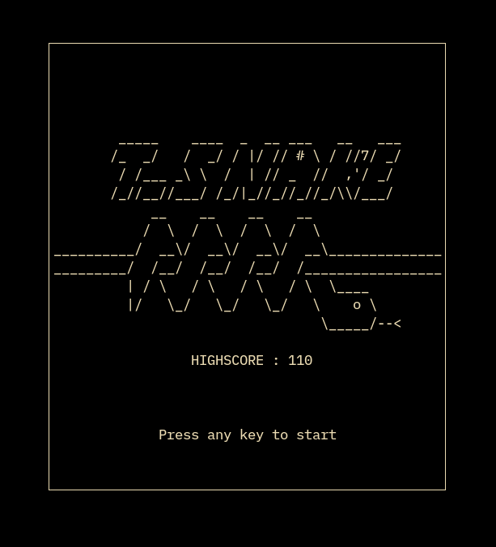

<div align="center">
<h1>tsnake</h1>

C++ Terminal Snake game made using Ncurses library.
</div>


<h4>installation</h4> 

```
c++ -o tsnake tsnake.cpp -lncurses
./tsnake
```
<br>

<div align="center">



</div>
